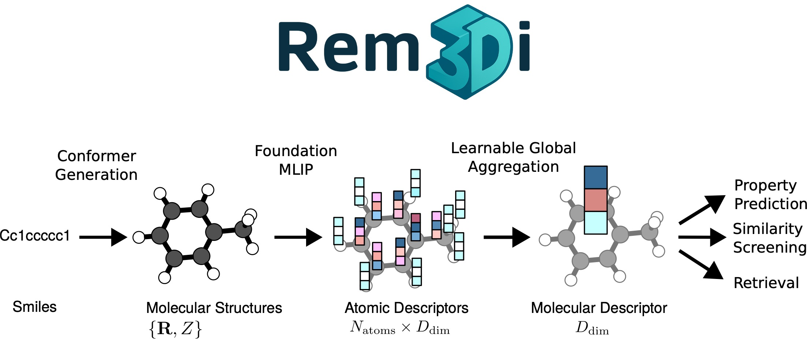

# Rem3Di documentation

**Rem3Di** (`remedi`) repurposes the latent features of a frozen atomistic
foundation model — a machine-learned interatomic potential such as MACE — into a
single fixed-length descriptor of a whole molecule. The descriptor reflects the
molecule's three-dimensional shape and does not depend on the order in which the
atoms are listed. To capture handedness it adds **pseudoscalar** features, which
are unchanged by rotation but reverse sign under mirror reflection, so the
descriptor distinguishes enantiomers. The result is a drop-in feature vector for
property prediction, virtual screening, and retrieval.

<p align="center">
  
</p>

<p align="center">
  <strong>Paper:</strong>
  <a href="https://openreview.net/challenge?redirect=%2Fpdf%3Fid%3DjOmZsvXoK5" target="_blank" rel="noopener">NeurIPS 2025 Workshop</a>
  &middot; arXiv (coming soon)
</p>

## How to read these docs

Pick the page for what you want to do. Each page is self-contained: **what you'll
do → prerequisites → steps → outputs → next steps**.

| I want to…                                                          | Start here                                      |
| ------------------------------------------------------------------- | ----------------------------------------------- |
| Install the package                                                 | [Installation](installation.md)                 |
| Get descriptors from a published model in 5 minutes                 | [Quickstart](quickstart.md)                     |
| Embed a dataset / benchmark a model                                 | [Evaluate a model](evaluate-a-model.md)         |
| Train a predictor on my own labels                                  | [Train a downstream model](train-downstream.md) |
| Train a Rem3Di model from scratch                                   | [Train from scratch](train-from-scratch.md)     |
| Turn SMILES/structures into a dataset                               | [Prepare a dataset](prepare-a-dataset.md)       |
| Extract chirality-sensitive pseudoscalars from equivariant features | [Pseudoscalars](pseudoscalars.md)               |
| Understand model dirs, datasets, descriptor shapes                  | [Concepts](concepts.md)                         |

## The three stages

```
                     ┌─────────────────────────────────────────────┐
 SMILES / xyz  ──►   │ Prepare a dataset  →  MoleculeDataset (zarr) │
                     └─────────────────────────────────────────────┘
                                          │
             ┌────────────────────────────┼────────────────────────────┐
             ▼                            ▼                             ▼
   Evaluate a model          Train a downstream model     Train from scratch
   (published .pth →         (frozen descriptors +        (self-supervised
    descriptors)              your labels → head)          denoising pretrain)
```

Most users only need **Evaluate** + **Train downstream**: take a published model,
embed your molecules, fit a head on your labels. Training from scratch is for
producing a new Rem3Di descriptor model.

## Runnable examples

Short, copy-and-adapt notebooks live in [`examples/`](https://github.com/steffen-wedig/3DMolecularDescriptors/tree/main/examples):

- `01_get_descriptors.ipynb` — model dir → descriptors
- `02_train_downstream_head.ipynb` — descriptors + labels → trained head (runs on synthetic data, no GPU)
- `03_build_dataset_from_smiles.ipynb` — SMILES → MoleculeDataset
- `04_pretrain_mini.ipynb` — a smoke-sized pretraining run
- `05_pseudoscalars.ipynb` — equivariant features → chirality-sensitive pseudoscalars (CPU, no model)
